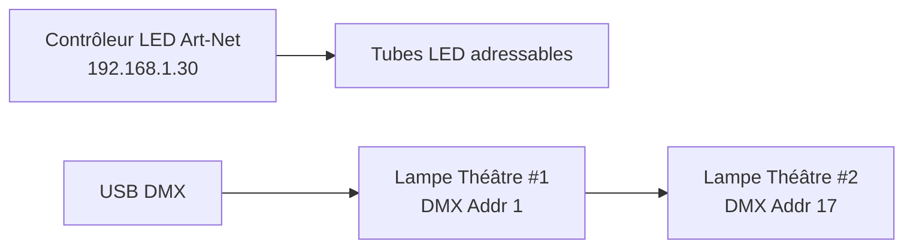
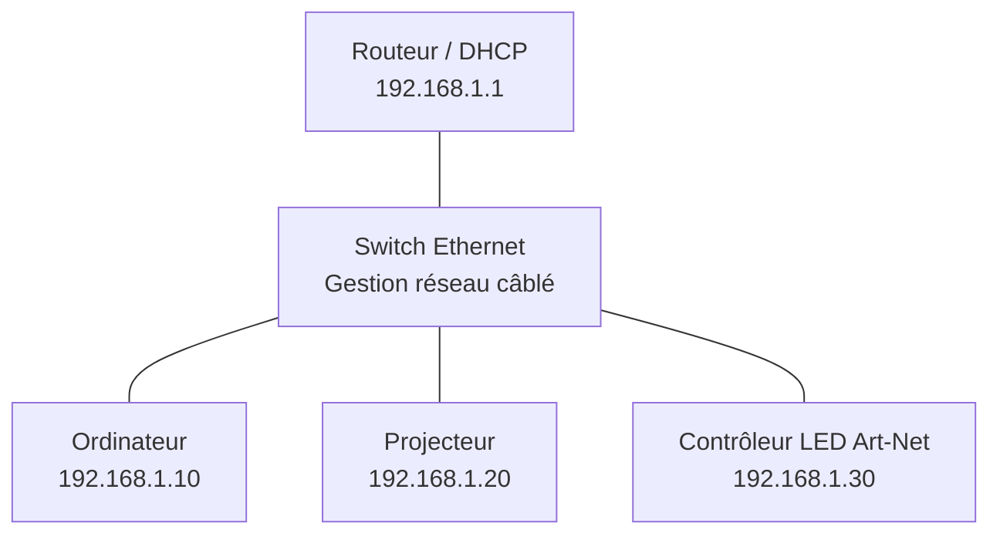

#  <!-- %: BLOC4 -->Installation multimédia<!-- %; -->

<!-- %: DESCRIPTION_EVS_4 -->
Réaliser une installation multimédia à grande échelle sur mesure.
<!-- %; -->

## Description

Concevoir, installer et déployer une **installation multimédia interactive**, en utilisant les équipements et l'espace disponibles.

Le dispositif doit permettre un contrôle en temps réel des éléments visuels, lumineux et sonores à partir de capteurs (M5Stack Atom + Units). Vous devez livrer une installation stable, sécuritaire et conforme aux standards professionnels.

## Livrables

### Installation fonctionnelle

L’installation devra inclure et mettre en service :

* **Une projection vidéo** installée, ajustée et contrôlée via Ethernet.
* **Un système d’éclairage adressable DMX** (lampes de type théâtre).
* **Un système d’éclairage adressable Art-Net** (tubes LED, pixels, strips, etc.).
* **Un système audio stéréo**, alimenté et câblé proprement.
* **Les capteurs M5Stack Atom + Units**, intégrés au contrôle en temps réel.

## Contraintes techniques

### Éclairage (DMX et Art-Net)

Votre installation doit :

* Envoyer un signal **DMX** fiable aux appareils d’éclairage de type théâtre.
* Envoyer un signal **Art-Net via Ethernet** aux contrôleurs de LED adressables.
* Assurer un adressage clair (univers DMX, canaux, nodes Art-Net).
* Garantir une synchronisation fluide avec les capteurs.

### Projection vidéo

* Le projecteur doit être **branché en Ethernet** et **contrôlé via réseau** (protocole du manufacturier ou interface web).
* Le cadrage, le focus et l’orientation doivent être ajustés avec précision.
* La source vidéo doit être stable, propre et sans interruption.

#### PJlink

Outil pour parler découvrir et parler aux projecteurs

* https://codeberg.org/gllm/gd-pjlink/releases

Outil pour parler à OBS (via WebSocket)

*  https://gllm.codeberg.page/gd-obs-navigator

### Audio

* Le système audio stéréo doit être fonctionnel et câblé correctement.
* Les niveaux doivent être testés et uniformes.
* Une méthode pour gérer le volume doit être accessible

### Réseau câblé

Les composantes de votre installation doivent utiliser le **réseau filaire** (Ethernet)

* L’ordinateur principal doit être **câblé en Ethernet**.
* Le projecteur doit être **câblé en Ethernet**.
* Le ou les contrôleurs LED adressables doivent être **câblés en Ethernet**.
* DMX peut être câblé en XLR ou via un node DMX → Art-Net.

### Connaitres vos objets sur le réseau

* Adresse IP du projecteur
* Adresse IP de l’ordinateur
* Adresse IP des contrôleurs Art-Net
* Adresse IP du routeur/switch (le cas échéant)
* Adresses réservées ou DHCP utilisées

#### Open IP Scanner 

Outil pour scanner le réseau local

* https://codeberg.org/gllm/Open-IP-Scanner/releases

##  Exigences organisationnelles

### Planification

* Avant toute installation, l’équipe doit définir une **stratégie de déploiement**.
* Un plan clair doit être produit : disposition, réseau, alimentation, sécurité.
* La gestion des appareils partagés doit être coordonnée entre les équipes.

### Travail d’équipe

* Chaque membre doit contribuer à la planification, au câblage et aux tests.
* Les décisions techniques doivent être prises collectivement et justifiées.
* La communication et la coordination sont essentielles pour éviter les conflits d’usage des équipements partagés.

### Sécurité et propreté

* Les câbles doivent être fixés, rangés et sécurisés.
* Aucune charge ne doit être mal distribuée ou branchée de façon risquée.
* Les appareils doivent être stables, correctement posés et non obstrués.

---

## Critères de réussite

Votre installation sera évaluée sur :

* Qualité du l'installation 
    * Propreté, stabilité, sécurité, organisation
* Fiabilité du réseau câblé 
    * (pas de coupures, IP cohérentes).
* Qualité du signal DMX et Art-Net 
    * adressage correct, absence de délai).
* Réactivité de l’interaction 
    * capteurs produit un réaction multimédia.
* Cohérence Générale 
    * Installation (visuel, lumière, son).
* Collaboration et coordination démontrées par l’équipe.

---

## Démonstration finale

Chaque équipe devra :

* Présenter l'installation en fonction.
* Démontrer le rôle de chaque capteur et son impact sur la projection, la lumière et le son.
* Justifier ses choix techniques.
* Expliquer la répartition des rôles et la collaboration interne.

* [Intégrations de apprentissages](../../03-savoirs/04/)
* [Évaluation formative](../../04-evaluations/formatives/04/)
* [Évaluation sommative](../../04-evaluations/sommatives/04/)
