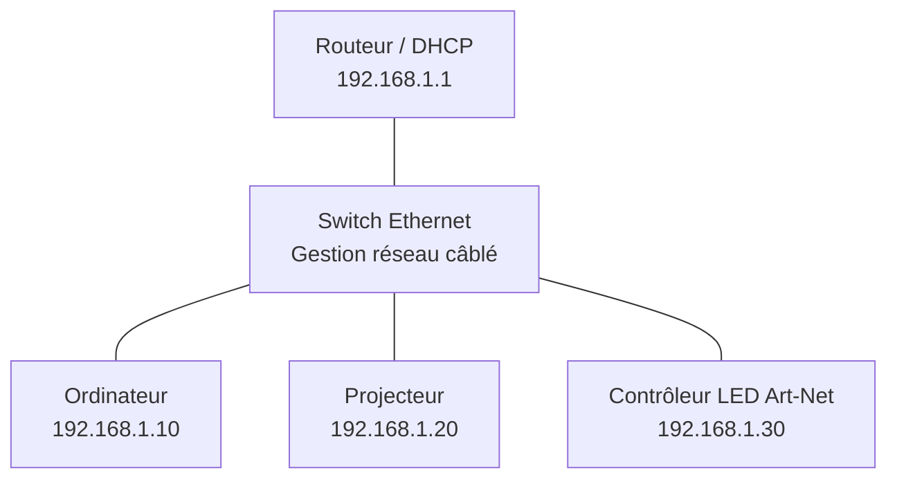
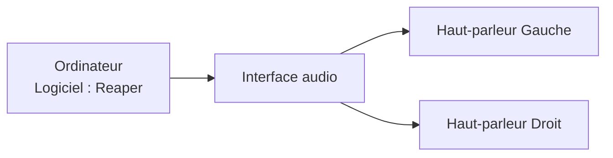
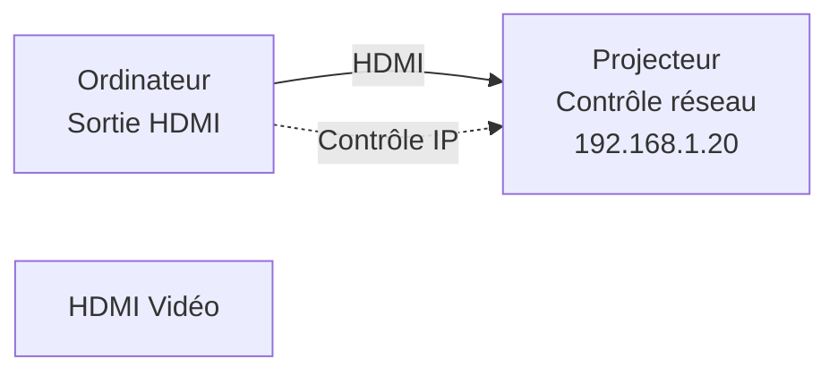
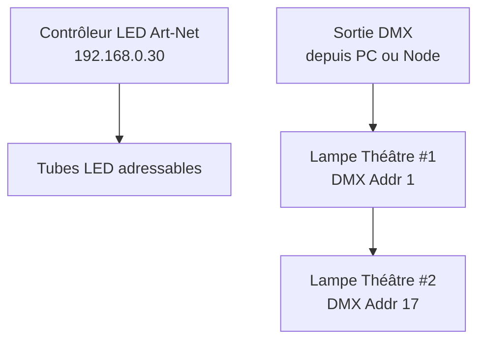

# Schéma de branchements

## Réseautique

```mermaid
flowchart TD

    SWITCH[Switch Ethernet<br/>Gestion réseau câblé]:::network

    PC[Ordinateur<br/>192.168.1.10]:::device
    PJ[Projecteur<br/>192.168.1.20]:::device
    ARTNET[Contrôleur LED Art-Net<br/>192.168.1.30]:::device
    ROUTER[Routeur / DHCP<br/>192.168.1.1]:::network

    ROUTER --- SWITCH
    SWITCH --- PC
    SWITCH --- PJ
    SWITCH --- ARTNET


```

## Audio

```mermaid
flowchart LR

    PC[Ordinateur<br/>Logiciel : Reaper]:::device
    HP_L[Haut-parleur Gauche]:::audio
    HP_R[Haut-parleur Droit]:::audio
    INTERFACE[Interface audio]:::audio

    PC --> INTERFACE
    INTERFACE --> HP_L
    INTERFACE --> HP_R

```    

## Vidéo

```mermaid
flowchart LR

    PC[Ordinateur<br/>Sortie HDMI]:::device
    PJ[Projecteur<br/>Contrôle réseau<br/>192.168.1.20]:::device
    HDMI[HDMI Vidéo]:::signal

    PC -- HDMI --> PJ
    PC -. Contrôle IP .-> PJ

```

## Lumières

```mermaid
flowchart TD

    %% Art-Net
    ARTNET[Contrôleur LED Art-Net<br/>192.168.0.30]:::device
    LEDS[Tubes LED adressables]:::light

    %% DMX (XLR)
    DMXCTRL[Sortie DMX<br/>depuis PC ou Node]:::dmx
    DMX1[Lampe Théâtre #1<br/>DMX Addr 1]:::light
    DMX2[Lampe Théâtre #2<br/>DMX Addr 17]:::light

    ARTNET --> LEDS

    DMXCTRL --> DMX1
    DMX1 --> DMX2
```