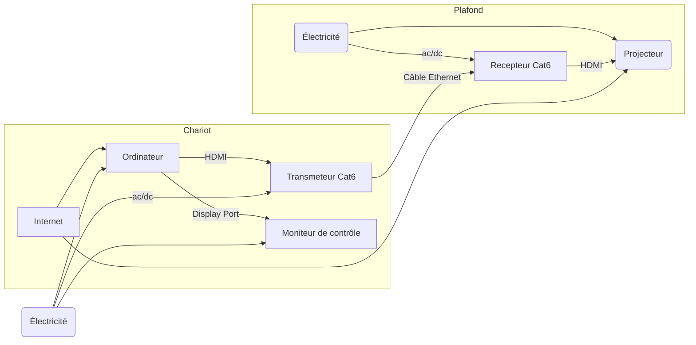
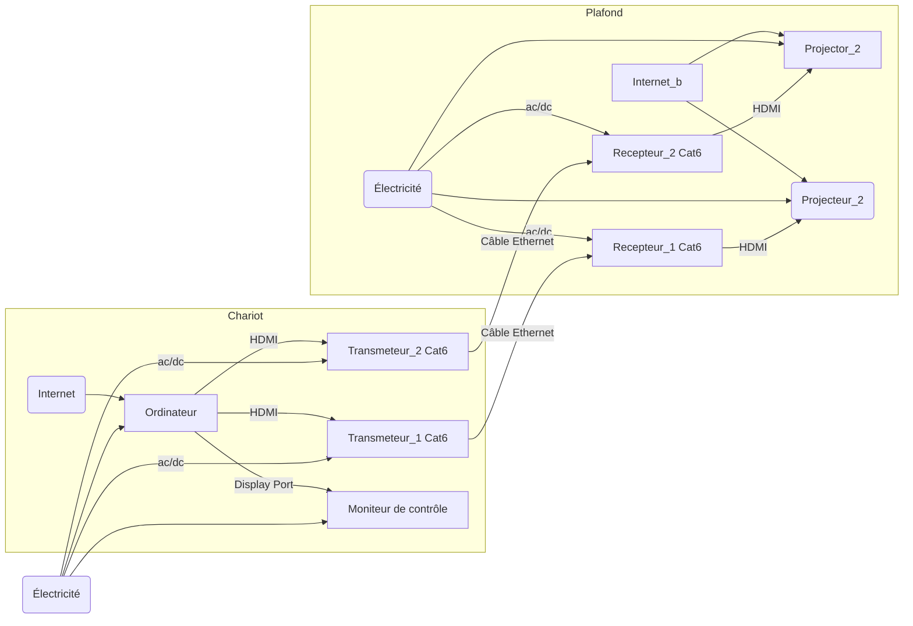

<!-- %: BLOC1_SAVOIR1  -->
# Branchement d’une installation de projection architecturale
<!-- %; -->

<!-- start-replace-subnav -->
* [Epson PowerLite 535W (grand angle)](/03-savoirs/01/01/EPSON_PowerLite_535W/)
* [Epson PowerLite 700U (Ultra grand angle)](/03-savoirs/01/01/EPSON_PowerLite_700U/)
* [Epson PowerLite 990U (Téléphoto)](/03-savoirs/01/01/EPSON_PowerLite_990U/)
<!-- end-replace-subnav -->

## Branchement d'un projecteur vidéo en studio

> [!IMPORTANT]
> Brancher les cables vidéo HDMI et DISPLAY port sur la carte graphique de l'ordinateur, pas sur la carte mère.

## Branchement de deux projecteurs vidéo en studio

## Edge-Blending deux projecteur

* Théorie https://paulbourke.net/miscellaneous/edgeblend/
* Implémentation dans touchdesigner https://derivative.ca/UserGuide/Palette:projectorBlend

