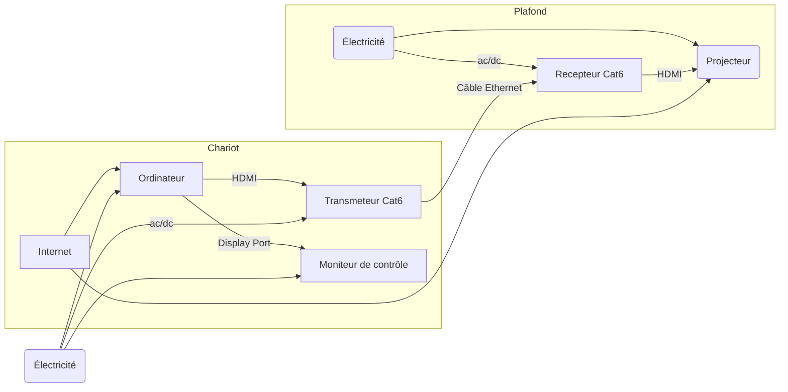
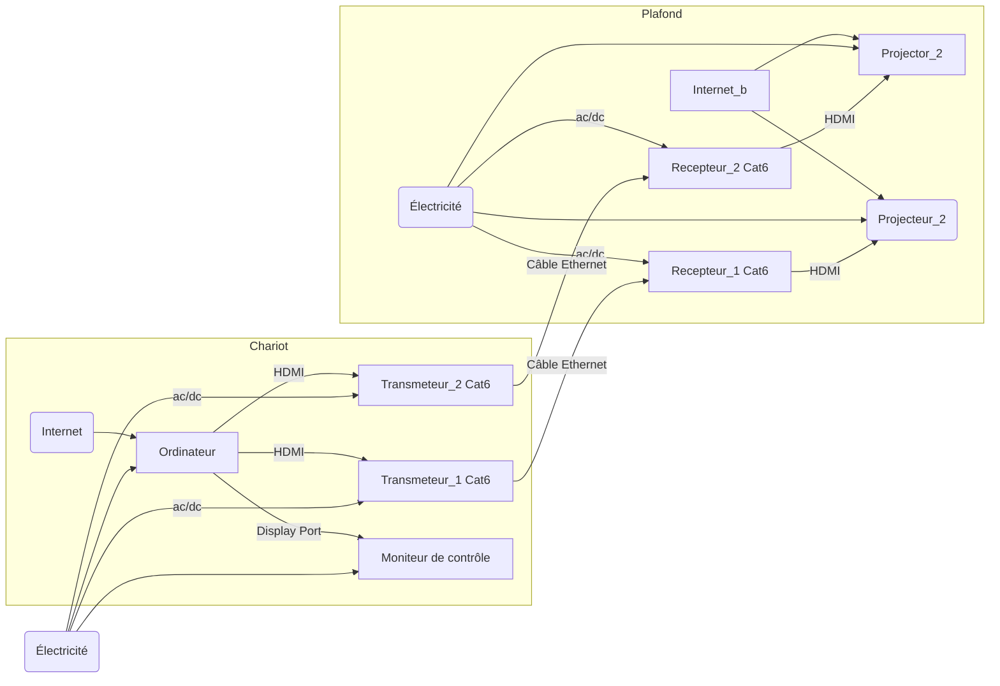
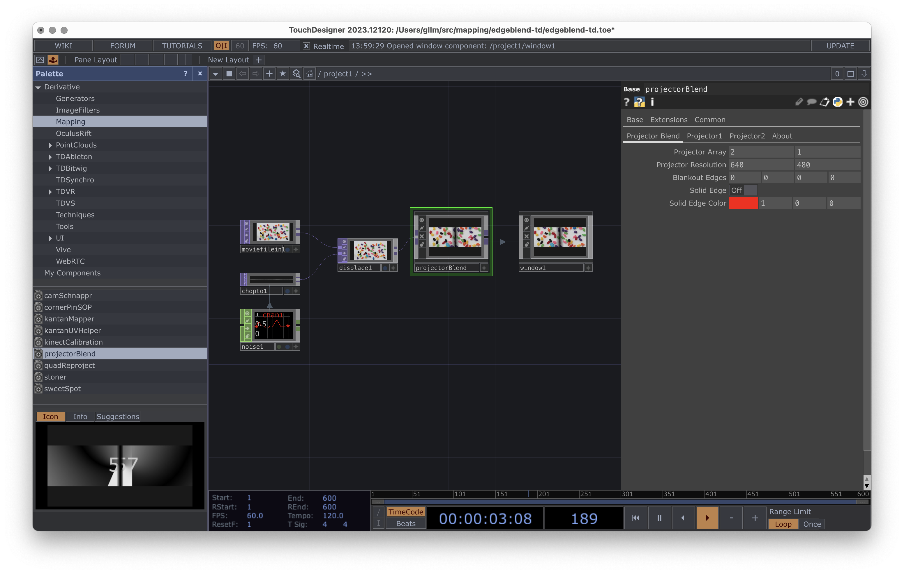
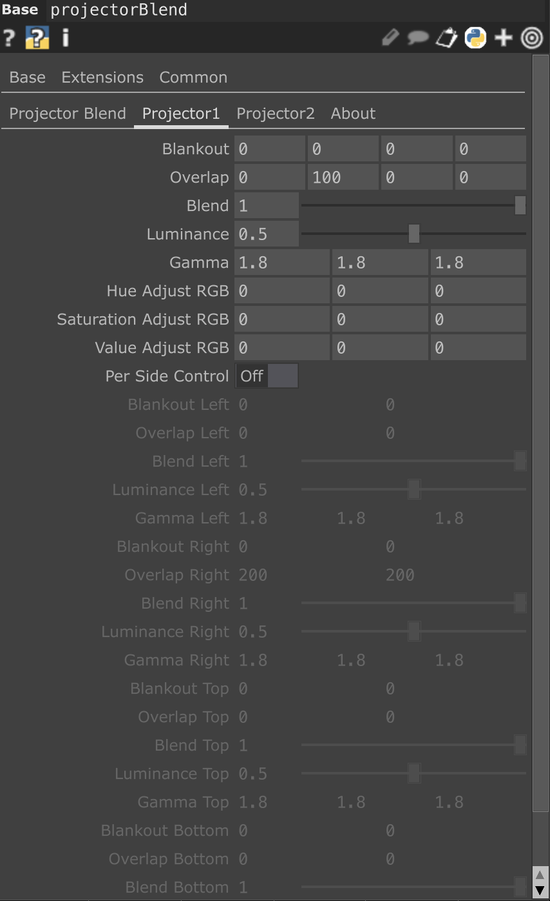
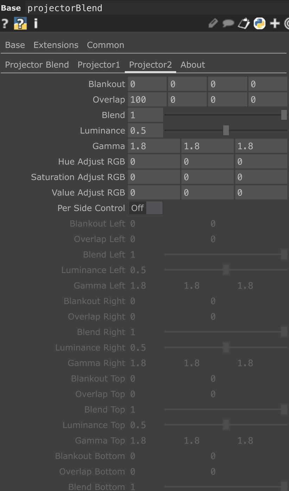

<!-- %: BLOC1_SAVOIR1  -->
# Branchement d’une installation de projection architecturale
<!-- %; -->

<!-- start-replace-subnav -->
* [Epson PowerLite 535W (grand angle)](/03-savoirs/01/01/EPSON_PowerLite_535W/)
* [Epson PowerLite 700U (Ultra grand angle)](/03-savoirs/01/01/EPSON_PowerLite_700U/)
* [Epson PowerLite 990U (Téléphoto)](/03-savoirs/01/01/EPSON_PowerLite_990U/)
<!-- end-replace-subnav -->

## Branchement d'un projecteur vidéo en studio

> [!IMPORTANT]
> Brancher les cables vidéo HDMI et DISPLAY port sur la carte graphique de l'ordinateur, pas sur la carte mère.

## Branchement de deux projecteurs vidéo en studio

## Edge-Blending deux projecteur

### Théorie

https://paulbourke.net/miscellaneous/edgeblend/

#### Mise en place physique 

**Matériel & surface**

* Prenez **2 projecteurs identiques** (idéal) et une surface **mate** (peinture matte / toile non brillante).
* Coupez les aides automatiques (auto-keystone, auto-iris, « dynamic contrast »).

**Positionnement**

* **Hauteur identique** des lentilles, **axes parallèles**, projecteurs **à la même distance** de l’écran.
* Cherchez un **léger chevauchement horizontal** (voir repères plus bas), centré à mi-hauteur.
* Préférez le **lens shift** pour aligner, évitez le **keystone** (ne l’utilisez qu’en dernier recours et le moins possible).

**Réglages optiques**

* **Focus** : pique identique dans la zone de recouvrement et sur les bords.
* **Zoom** : égalisez la taille d’image avant de toucher au blending.

**Égalisation d’image**

* Même mode d’image (ex. « Standard »), **température** proche de 6500 K, **gamma ≈ 2,2**.
* Alignez **luminosité/contraste** pour que les deux images se ressemblent **hors recouvrement**.

**Patrons de test**

* Projetez une **grille fine** + **rampes de gris/couleur**.
  Affinez **lacet** (gauche/droite), **tangage** (haut/bas) et **roulis** (rotation) jusqu’à ce que verticales/horizontales se superposent au pixel près dans la zone de recouvrement.

#### Edge blending 

**Principe**

* On **recouvre** les images sur une bande verticale, puis on **pondère** les intensités :
  poids **A = 1 − w(x)**, **B = w(x)**, où **w(x)** monte **doucement** de 0 à 1 dans la bande.

**Courbe de fondu**

* Utilisez une **courbe “douce”** (de type puissance) au lieu d’un simple linéaire.
  Réglage de base : **p ≈ 2** (transition plus naturelle, moins de « marche » visible).

**Gamma (clé pour éviter la bande grise)**

* Le fondu doit additionner des **luminances**, pas des valeurs brutes.
  Appliquez la **correction gamma** aux poids :
  $w_\text{gamma} = w^{1/G}$ avec **G ≈ 2,2**, **par canal R, G, B**.

**Affinage**

* Ajustez **largeur de recouvrement**, **p** (courbure) et (si dispo) un **offset central** pour éclaircir/assombrir la ligne médiane.
* Validez avec :

  1. **rampes** (gris/couleur) → pas de barre plus claire/sombre ;
  2. **grille** → pas de cassure ;
  3. **mouvement** (ligne diagonale qui traverse la couture) → pas de flash ou “step”.

---

#### Repères concrets (2×1080p)

* **Recouvrement conseillé** : **\~320–384 px** (≈ 17–20 %) de **1920 px**.
* **Largeur finale utile** = $2×1920 − \text{recouvrement}$
  → **3520 px** (recouvrement 320) à **3456 px** (384).
* Hauteur inchangée : **1080 px**.

####  Erreurs courantes à éviter

* Trop de **keystone** (privilégiez lens-shift).
* **Surface brillante** → couture visible selon le point de vue.
* **Niveaux de noir** très différents entre projecteurs.
* **Mise au point** inégale dans la zone de recouvrement.
* Recouvrement **trop étroit** (<10 %) → couture qui reste visible.

##### Mini-checklist

* [ ] Surface **mate**, projos **identiques**, aides auto **OFF**
* [ ] Hauteur/distance **identiques**, axes **parallèles**, **lens-shift** d’abord
* [ ] **Grille** → alignement géométrique OK (lacet/tangage/roulis)
* [ ] **Recouvrement 320–384 px**
* [ ] **Fondu p≈2**, **gamma-corrigé par canal (G≈2,2)**
* [ ] Vérif **rampes + mouvement** → couture **invisible** ✅

C’est tout : un bon **montage physique** fait 80 % du travail, le **blending gamma-corrigé** finit le job.

### Implémentation 

#### TouchDesigner

* Pallette/Mapping/projectorBlend

* Documentation : https://derivative.ca/UserGuide/Palette:projectorBlend

dans la version gratuite la résolution est limité à 1280 pixel de large.

* 
* 
* 

#### OBS 

* Edge-blending et cornerpin via LUA

[projection mapping Lua script](https://codeberg.org/gllm/obs-lua-projection-mapping) 

Installer via tool->Script  

* OBS spout 

Si vous voulez travailler avec spout, installez le plugin suivant : 

https://github.com/Off-World-Live/obs-spout2-plugin

