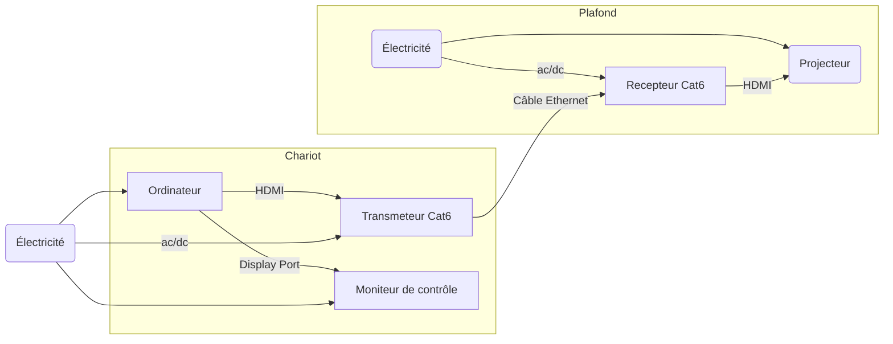

<!-- %: BLOC1_SAVOIR1  -->
# Branchement d’une installation de projection architecturale
<!-- %; -->

<!-- start-replace-subnav -->

<!-- end-replace-subnav -->

## Branchement d'un projecteur vidéo en studio

> [!IMPORTANT]
> Brancher les cables vidéo HDMI et DISPLAY port sur la carte graphique de l'ordinateur, pas sur la carte mère.

