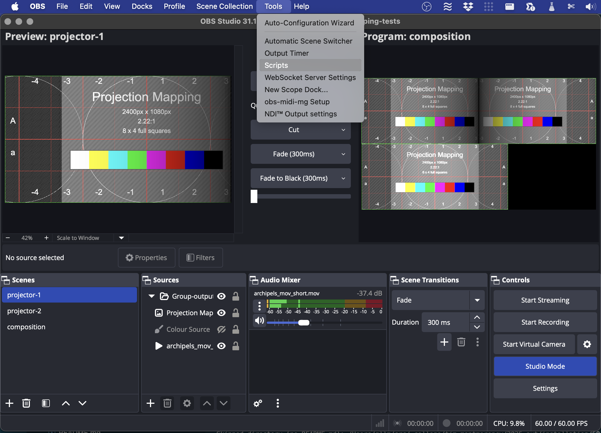
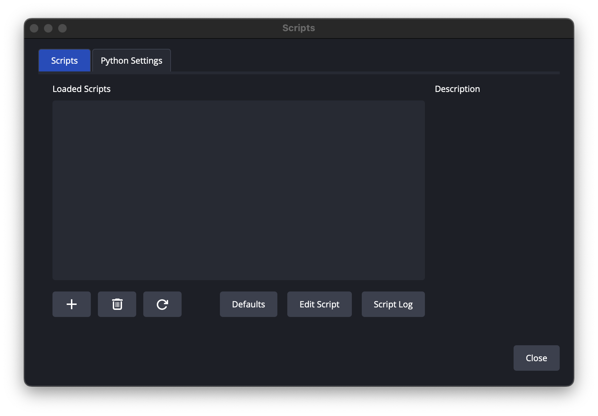
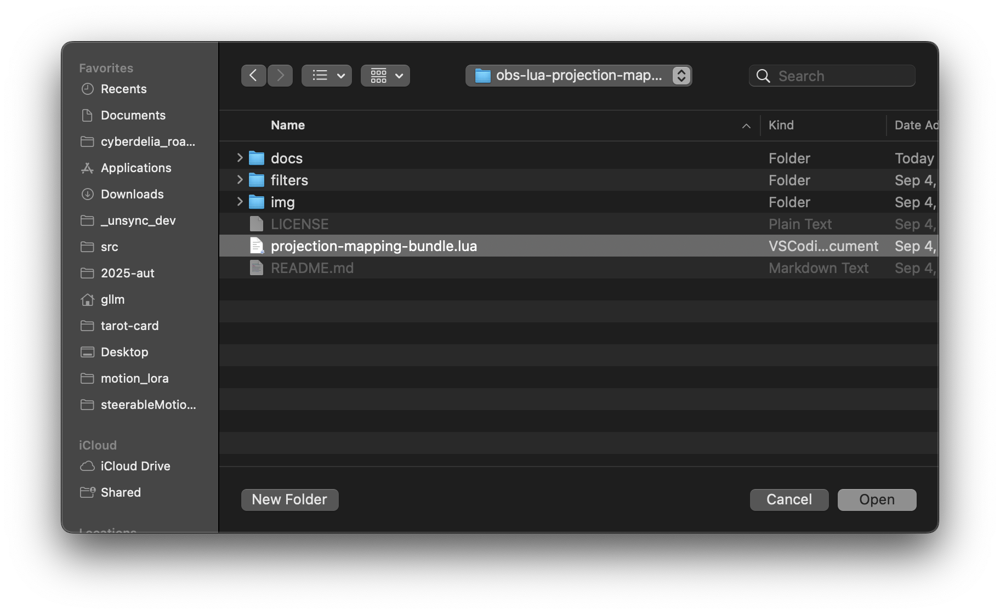

# OBS 

* [Projection Mapping dans OBS avec LUA](https://codeberg.org/gllm/obs-lua-projection-mapping) 

## Installation 

* Télécharger et décompresser le [repository](https://codeberg.org/gllm/obs-lua-projection-mapping/archive/main.zip) 

* Lancer l'application OBS

* Ouvrir tool->Script  

* 

* 

* 
