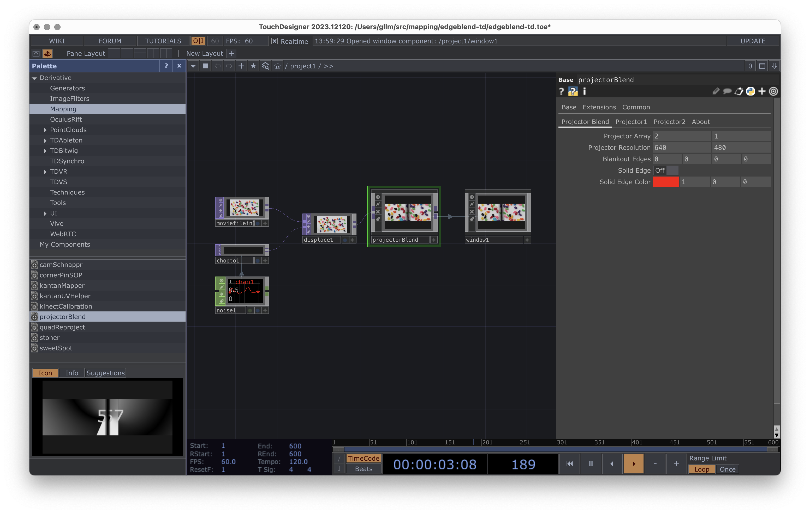
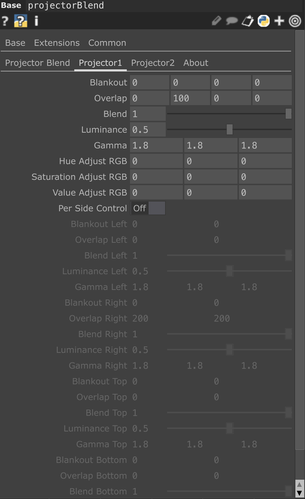
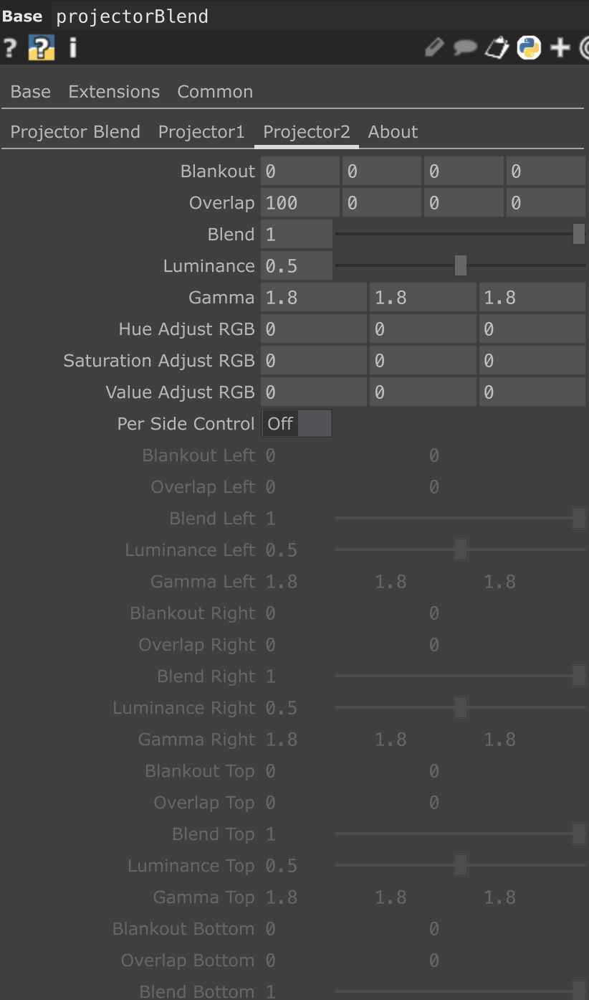

# Mapping dans touchdesigner

* Pallette/Mapping/projectorBlend

* Documentation : https://derivative.ca/UserGuide/Palette:projectorBlend

dans la version gratuite la résolution est limité à 1280 pixel de large.

* 
* 
* 

