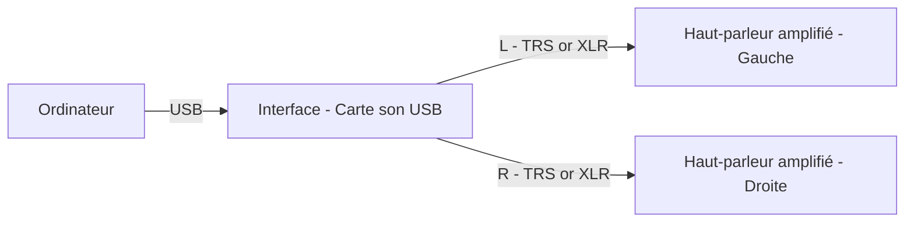

# Installation Stéréo simple

Remarques:

- Le PC envoie l'audio numérique via USB vers l'interface audio (carte son).
- L'interface convertit le signal en sorties analogiques gauche/droite (L/R).
- Utilisez des câbles symétriques (XLR ou TRS) si vos équipements le permettent.
- Réglez le volume principal sur l'interface et les volumes individuels des haut-parleurs pour éviter les saturations.