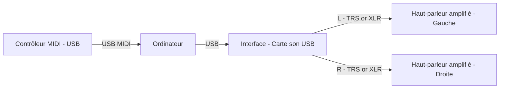

# Installation Stéréo simple et controlleur midi

Remarques:

- Le PC envoie l'audio numérique via USB vers l'interface audio (carte son).
- L'interface convertit le signal en sorties analogiques gauche/droite (L/R).
- Utilisez des câbles symétriques (XLR ou TRS) si vos équipements le permettent.
- Réglez le volume principal sur l'interface et les volumes individuels des haut-parleurs pour éviter les saturations.

Contrôleur MIDI et utilisation dans un DAW (REAPER)

Dans un workflow basé sur un DAW (ici REAPER), le contrôleur MIDI envoie des messages MIDI au système, REAPER reçoit ces messages et les distribue à une piste instrument (VSTi). Le VSTi génère l'audio, qui sort ensuite par l'interface audio vers les enceintes amplifiées.

Procédure pas-à‑pas (REAPER)

1. Branchez le contrôleur MIDI en USB et vérifiez qu'il est correctement détecté par le système (macOS : Configuration Audio/MIDI).
2. Dans REAPER : Options → Preferences → Audio → Device : sélectionnez votre interface audio (CoreAudio) et réglez rate / buffer size. Pour le jeu en direct, privilégiez un buffer faible (ex. 64–128 samples) si la CPU le permet.
3. Créez une nouvelle piste : Track → Insert new track.
4. Ajoutez un instrument VSTi : cliquez sur FX → Add → choisissez votre VSTi (par ex. Surge, Vital, Dexed). Le VSTi recevra les notes MIDI de la piste.
5. Configurez l'entrée MIDI de la piste : Input → MIDI Input → All MIDI Inputs (ou sélection spécifique). Activez "Record: input (MIDI)" et mettez le monitoring sur ON pour entendre en direct.
6. Vérifiez le routage audio : la sortie du VSTi doit être routée vers la sortie master (Hardware outputs 1/2). Utilisez le panneau Routing si vous devez diriger le son vers sorties spécifiques.
7. Ajustez la latence via la taille du buffer. Si vous avez toujours trop de latence, essayez d'autres drivers ou augmentez le sample rate.
8. Pour enregistrer : arme la piste (Record arm) et lancez l'enregistrement. Les notes MIDI seront sauvegardées et l'audio sortira par l'interface.

Conseils pratiques pour REAPER

- Mapping des contrôleurs : pour assigner un potentiomètre ou fader MIDI à un paramètre du plugin, faites un clic droit sur le paramètre dans le plugin → Parameter Modulation / MIDI Link, ou utilisez un outil comme ReaLearn pour des mappings plus avancés.
- Multi‑sorties : si votre VSTi propose plusieurs sorties stéréo, créez des pistes auxiliaires et routez chaque sortie vers la sortie matérielle voulue (utile pour multi‑timbres ou routing vers plusieurs enceintes).
- Compensation de latence : activez la compensation automatique des délais dans REAPER et vérifiez le réglage de "Latency Compensation" si vous utilisez des plugins qui introduisent de la latence.

Dépannage rapide

- Aucun son : vérifiez que la piste est armée, que le monitoring est activé, que le plugin est chargé et que la sortie est routée vers le master et la bonne interface.
- REAPER ne détecte pas le contrôleur : vérifiez la présence du périphérique dans Preferences → MIDI Devices et activez-le comme input.
- Latence audible : baissez la taille de buffer, changez le driver audio, ou augmentez la fréquence d'échantillonnage; si des artefacts apparaissent augmentez légèrement le buffer.

Logiciels & outils recommandés

- REAPER (DAW léger et configurable)  
- VSTi gratuits recommandés : Surge, Vital, Dexed, Helm, Spitfire LABS 
- ReaLearn (plugin pour mapping MIDI avancé)

