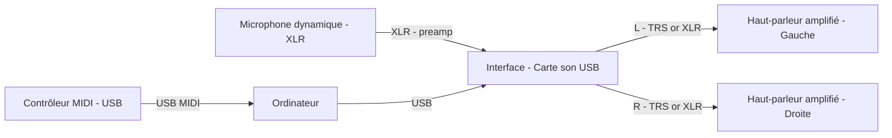

# Installation Stéréo + midi + micro

Remarques:

- Le PC envoie l'audio numérique via USB vers l'interface audio (carte son).
- L'interface convertit le signal en sorties analogiques gauche/droite (L/R).
- Utilisez des câbles symétriques (XLR ou TRS) si vos équipements le permettent.
- Réglez le volume principal sur l'interface et les volumes individuels des haut-parleurs pour éviter les saturations.

Microphone / entrée micro

- Pour un microphone dynamique, connectez-le en XLR à une entrée micro de l'interface. Activez le préampli et réglez le gain pour éviter le clipping.
- Si disponible, activez le filtre passe‑haut (high‑pass) pour éliminer les bruits de basse fréquence indésirables.

Contrôleur MIDI et utilisation dans un DAW (REAPER)

Dans un workflow basé sur un DAW (ici REAPER), le contrôleur MIDI envoie des messages MIDI au système, REAPER reçoit ces messages et les distribue à une piste instrument (VSTi). Le VSTi génère l'audio, qui sort ensuite par l'interface audio vers les enceintes amplifiées.

Procédure pas-à‑pas (REAPER)

1. Branchez le contrôleur MIDI en USB et vérifiez qu'il est correctement détecté par le système (macOS : Configuration Audio/MIDI).
2. Dans REAPER : Options → Preferences → Audio → Device : sélectionnez votre interface audio (CoreAudio) et réglez rate / buffer size. Pour le jeu en direct, privilégiez un buffer faible (ex. 64–128 samples) si la CPU le permet.
3. Créez une nouvelle piste : Track → Insert new track.
4. Ajoutez un instrument VSTi : cliquez sur FX → Add → choisissez votre VSTi (par ex. Surge, Vital, Dexed). Le VSTi recevra les notes MIDI de la piste.
5. Configurez l'entrée MIDI de la piste : Input → MIDI Input → All MIDI Inputs (ou sélection spécifique). Activez "Record: input (MIDI)" et mettez le monitoring sur ON pour entendre en direct.
6. Vérifiez le routage audio : la sortie du VSTi doit être routée vers la sortie master (Hardware outputs 1/2). Utilisez le panneau Routing si vous devez diriger le son vers sorties spécifiques.
7. Ajustez la latence via la taille du buffer. Si vous avez toujours trop de latence, essayez d'autres drivers ou augmentez le sample rate.
8. Pour enregistrer : arme la piste (Record arm) et lancez l'enregistrement. Les notes MIDI seront sauvegardées et l'audio sortira par l'interface.

Conseils pratiques pour REAPER

- Mapping des contrôleurs : pour assigner un potentiomètre ou fader MIDI à un paramètre du plugin, faites un clic droit sur le paramètre dans le plugin → Parameter Modulation / MIDI Link, ou utilisez un outil comme ReaLearn pour des mappings plus avancés.
- Multi‑sorties : si votre VSTi propose plusieurs sorties stéréo, créez des pistes auxiliaires et routez chaque sortie vers la sortie matérielle voulue (utile pour multi‑timbres ou routing vers plusieurs enceintes).
- Compensation de latence : activez la compensation automatique des délais dans REAPER et vérifiez le réglage de "Latency Compensation" si vous utilisez des plugins qui introduisent de la latence.

Dépannage rapide

- Aucun son : vérifiez que la piste est armée, que le monitoring est activé, que le plugin est chargé et que la sortie est routée vers le master et la bonne interface.
- REAPER ne détecte pas le contrôleur : vérifiez la présence du périphérique dans Preferences → MIDI Devices et activez-le comme input.
- Latence audible : baissez la taille de buffer, changez le driver audio, ou augmentez la fréquence d'échantillonnage; si des artefacts apparaissent augmentez légèrement le buffer.

Logiciels & outils recommandés

- REAPER (DAW léger et configurable)  
- VSTi gratuits recommandés : Surge, Vital, Dexed, Helm, Spitfire LABS 
- ReaLearn (plugin pour mapping MIDI avancé)

Test : monitoring direct vs monitoring logiciel et effet (réverbération)

Il est important de tester la différence entre le monitoring direct (hardware) et le monitoring via le DAW (software), surtout si vous voulez entendre un effet comme la réverbération pendant le jeu ou la prise. Voici une procédure simple et des options pratiques dans REAPER.

Protocole de test

1. Préparez la prise : micro dynamique branché, gain réglé, monitoring casque/sortie connecté.
2. Monitoring direct (hardware) : activez le direct monitoring sur votre interface (si disponible). Centrez le mélange de monitoring en écoutant uniquement le signal direct du micro (généralement zero-latency). Ne chargez aucune réverbération dans le DAW. Notez la sensation (latence, présence, fraîcheur du son).
3. Monitoring logiciel sans effet : dans REAPER, activez le monitoring de la piste (Input monitoring ON) sans insérer d'effet. Réglez la taille du buffer pour obtenir une latence acceptable. Comparez la latence/perception avec le monitoring direct.
4. Monitoring logiciel avec réverbération : ajoutez une instance de réverbération (en insert ou via un send → aux) sur la piste microphone ou sur un aux. Activez le monitoring et écoutez la différence. Notez si la réverbération est audible et si la latence reste acceptable.
5. Variante : utilisez un send vers un aux (pré-fader si vous voulez entendre l'effet indépendamment du fader) pour surveiller la réverbération sans affecter le signal sec envoyé vers l'enregistrement.

Options et astuces dans REAPER

- Input FX vs Insert FX : si vous voulez entendre un effet appliqué au signal avant l'enregistrement, utilisez "Add -> Input FX" sur la piste (REAPER permet d'appliquer des FX d'entrée si votre interface/driver l'autorise). Sinon, les inserts sont appliqués lors du monitoring logiciel.
- Réduire la latence : diminuez la taille du buffer (Options → Preferences → Audio → Device). Attention aux artefacts si le buffer est trop bas.
- Mix casque indépendant : beaucoup d'interfaces permettent de créer un mix casque séparé où vous pouvez envoyer le signal sec et un send d'effet traité par le DAW — utile pour performer avec une réverb sans sacrifier la faible latence du direct monitoring.
- Compromis pratique : pour des performances live, préférez le monitoring direct pour la latence, et alimentez la réverbération uniquement dans le casque via un aux ou dans la PA si la latence du système le permet.

Problèmes courants

- Vous n'entendez pas la réverbération en monitoring direct : normal, le monitoring direct bypass le DAW. Pour entendre l'effet, il faut monitorer via le DAW ou envoyer la réverb à un mix casque séparé.
- Latence trop élevée avec effet : essayez d'utiliser un plugin moins gourmand, réduisez la qualité temporairement, ou augmentez le buffer pendant la performance non interactive.

Conclusion rapide

Tester systématiquement ces options vous aidera à choisir la meilleure configuration selon le contexte (studio vs performance live). Pour la plupart des installations : monitoring direct = latence minimale; monitoring logiciel = plus de flexibilité (effets audibles) mais demande une gestion fine de la latence ou des mixes casque séparés.

