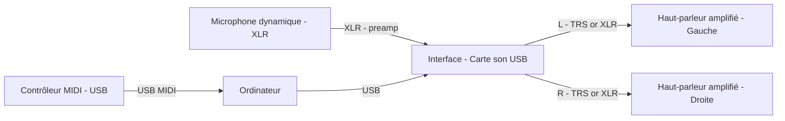
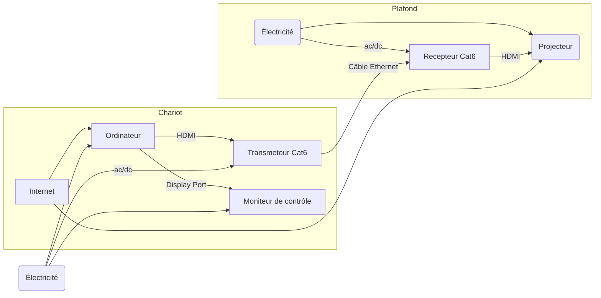

# Installation Stéréo + midi + projecteur + micro

## Audio

## Video

## Branchement d'un projecteur vidéo en studio

### Description

L’installation permet de piloter une projection vidéo interactive synchronisée au son : le contrôleur MIDI et le micro alimentent l’ordinateur (centre de production), l’ordinateur produit l’audio via l’interface vers deux enceintes amplifiées, et envoie la vidéo au projecteur via un émetteur/récepteur HDMI-over-Cat6. L’interactivité est réalisée dans le logiciel sur l’ordinateur qui reçoit MIDI et audio, et déclenche visuels et sons en temps réel.

