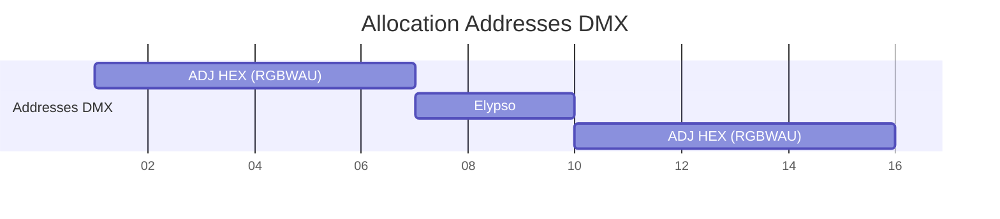

# Adresses

Voici des méthode pour représenter visuellement les addresses des lampes 

## Protocole DMX (sommaire)

Le DMX (DMX512) est un protocole série standard pour le contrôle d'éclairages et d'appareils scéniques. Principaux points à retenir :

- Univers et canaux : un "univers" DMX contient 512 canaux (adresses) numérotés 1–512. Chaque canal transporte une valeur 0–255.
- Physique : le signal DMX est envoyé en RS-485 différentiel sur une paire torsadée blindée. Les connexions courantes utilisent des XLR 5 ou 3 broches ou des liaisons RJ45/ethernet spécialisées.
- Topologie : on câblera en série (daisy-chain) du contrôleur vers les appareils ; ne pas faire de dérivations en "T". Pour diviser un signal, utiliser un splitter actif.
- Terminason : la ligne DMX doit généralement être terminée (résistance de 120 Ω) à l'extrémité la plus lointaine pour éviter les réflexions et pertes de signal.
- Distances et débits : longueur maximale pratique ≈ 300 m selon câble et environnement ; débit ~250 kbps, rafraîchissement typique sufficient pour l'éclairage.
- Adressage et patch : chaque fixture occupe N canaux selon ses paramètres (ex. 6 canaux pour RGBWAU). Bien documenter l'adresse de départ et le nombre de canaux lors du patching.
- Bonnes pratiques : vérifier l'alimentation, séparer alimentation électrique et signal, utiliser des câbles adaptés, prévoir des tests de continuité et un plan de secours.

Pour des contrôles bidirectionnels (statut, configuration), DMX peut être étendu avec RDM (Remote Device Management). Pour des installations complexes, gérer plusieurs univers via une interface multicœur ou un routeur DMX.

## Via mermaid gantt

