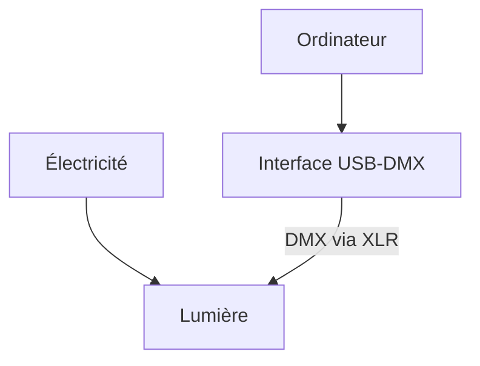
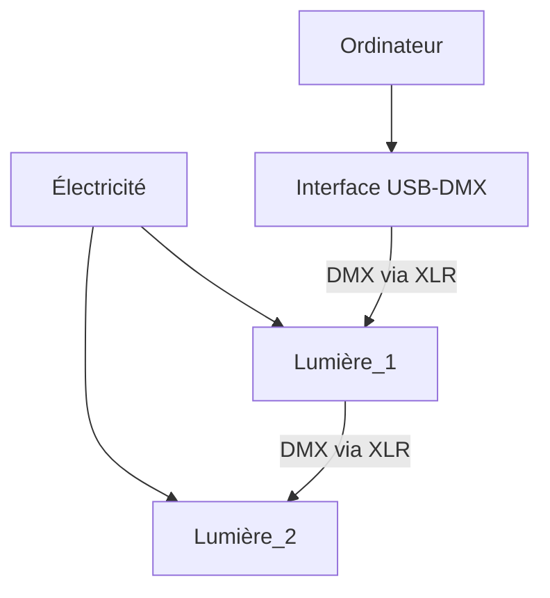
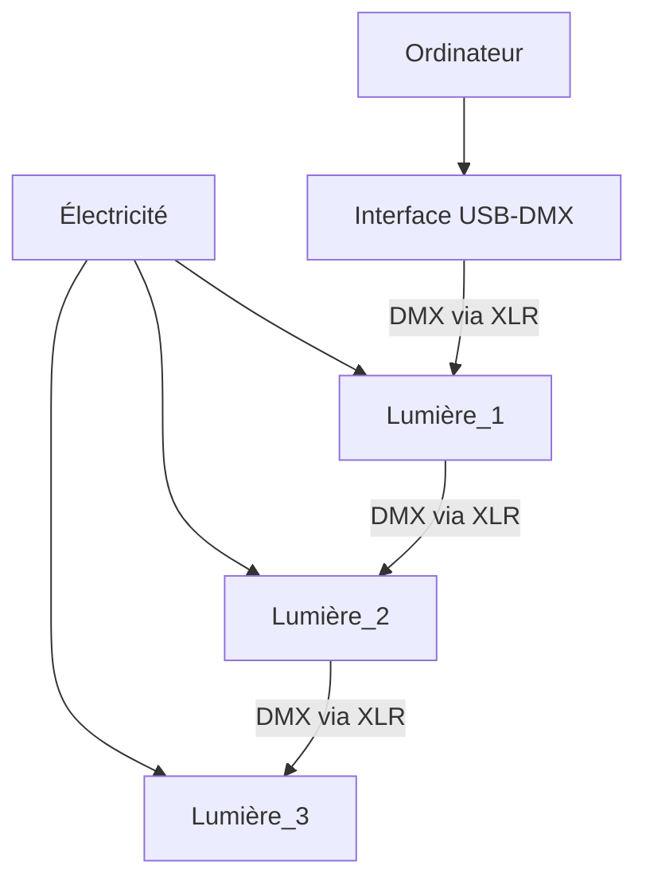

# Brancher des lampes

## Brancher des lampes

### Simple

```mermaid
graph TD
Électricité --> Lumière
Ordinateur --> USB-DMX[Interface USB-DMX ] --DMX via XLR--> Lumière

```
### Duo

```mermaid
graph TD
Électricité --> Lumière_1
Électricité --> Lumière_2
Lumière_1 --DMX via XLR--> Lumière_2
Ordinateur --> USB-DMX[Interface USB-DMX ] --DMX via XLR--> Lumière_1
```

### Trio

```mermaid
graph TD
Électricité --> Lumière_1
Électricité --> Lumière_2
Électricité --> Lumière_3
Lumière_1 --DMX via XLR--> Lumière_2 --DMX via XLR--> Lumière_3
Ordinateur --> USB-DMX[Interface USB-DMX ] --DMX via XLR--> Lumière_1

```