# Assignation Midi

## QLC midi mapping

### Spécifique à Windows 

#### Drivers Midi Virtuel

* Utiliser [loopmidi](https://www.tobias-erichsen.de/software/loopmidi.html)
* Démarrer loop midi 

### Plugdata 

* [Plugdata](https://plugdata.org/)

#### Configuration MIDI plugdata 

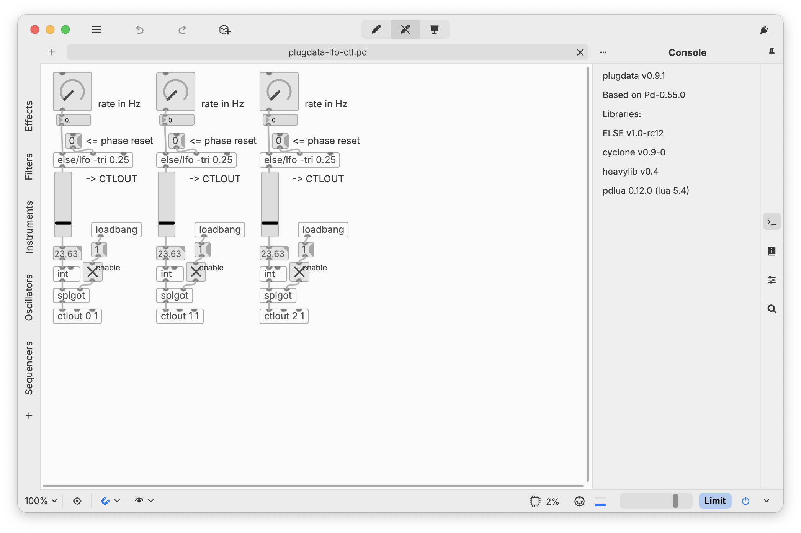

* réglage (menu hamburger)

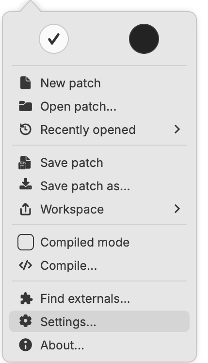

* output Loopmidi (sur pc ) ou plugdata (sur mac)
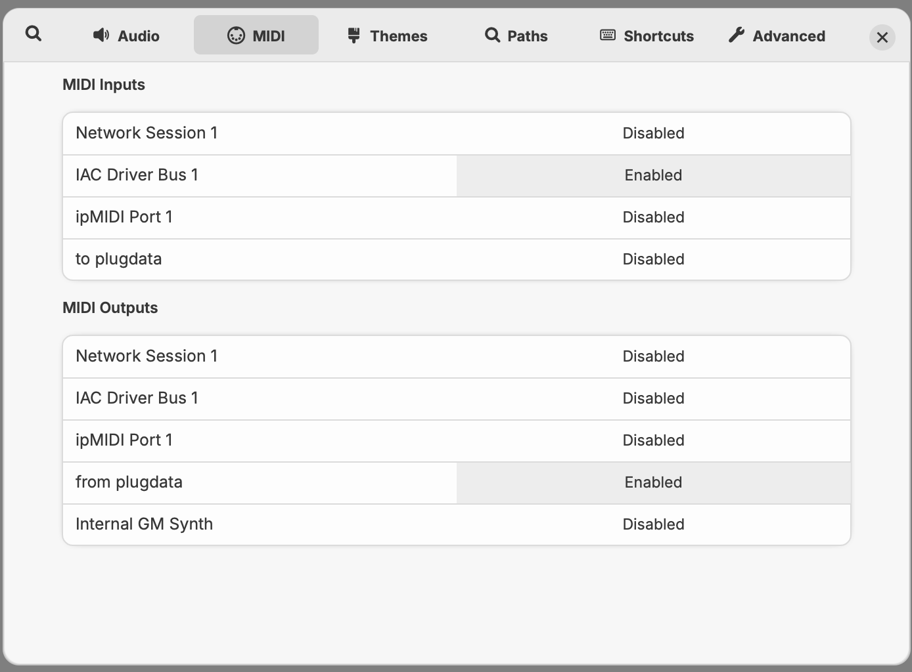

#### Lien vers des patchs PlugData

[Patch Plugdata LFO](./plugdata-lfo-ctl.pd) 

[Patch Plugdata Analyse](./analyse_audio.pd) 

### Configuration QLC 

#### Entrée midi

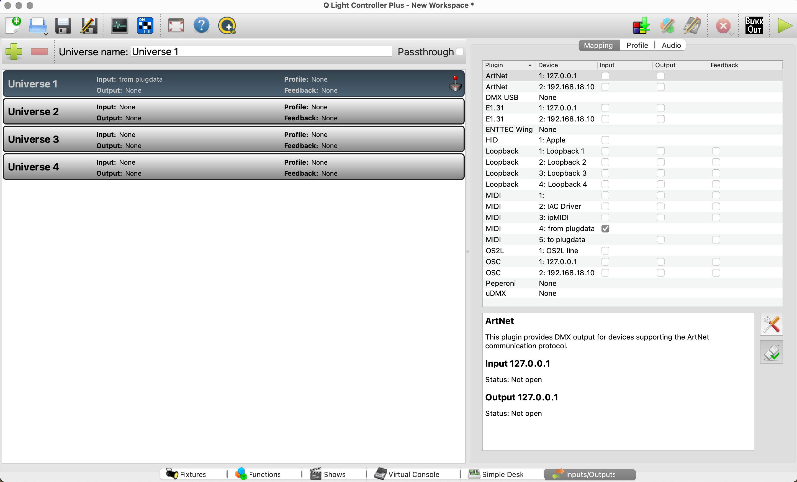

#### midi mapping 

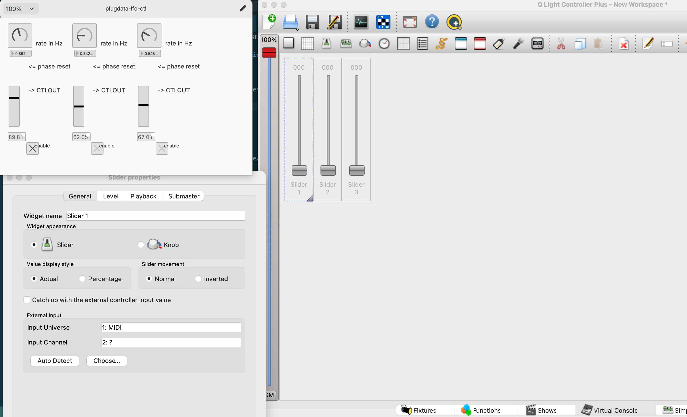

### Reaper

Créer des courbe d'automation MIDI et les envoyer à QLC

#### Créer un élément MIDI 

* 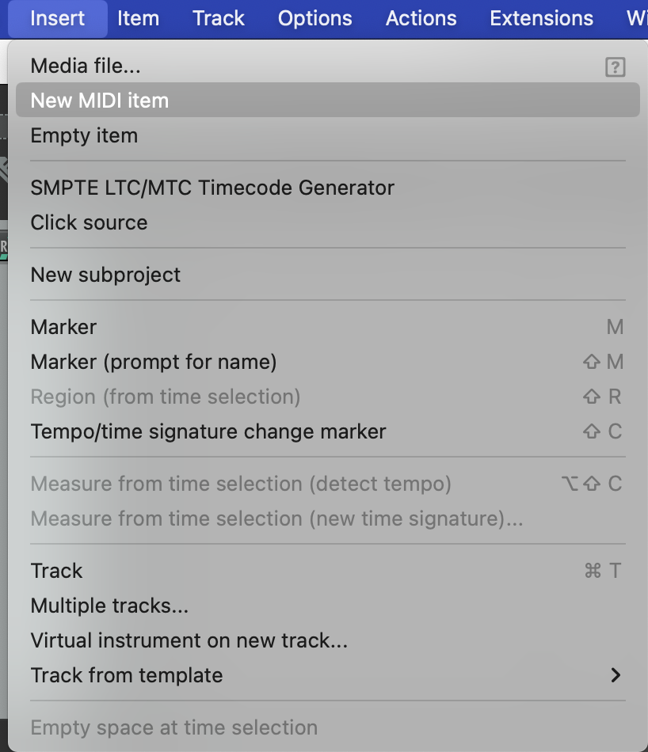

* 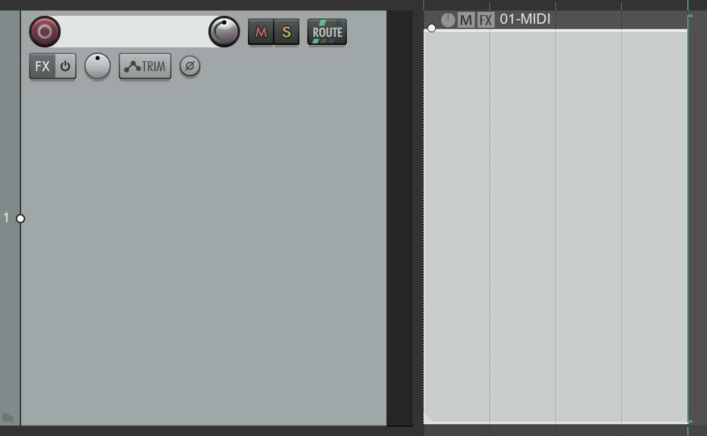

#### Double cliquer l'élément midi pour éditer

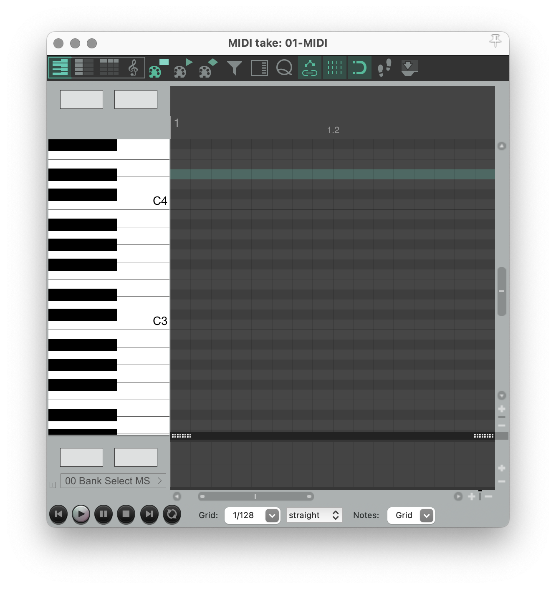

#### Ajouter des piste de CC via le petit +

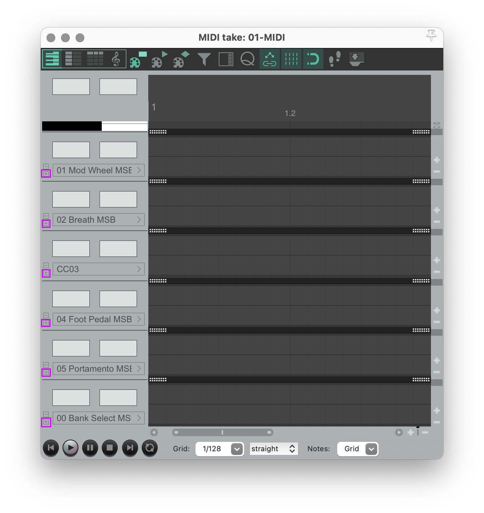

#### Dessiner des courbes expressives

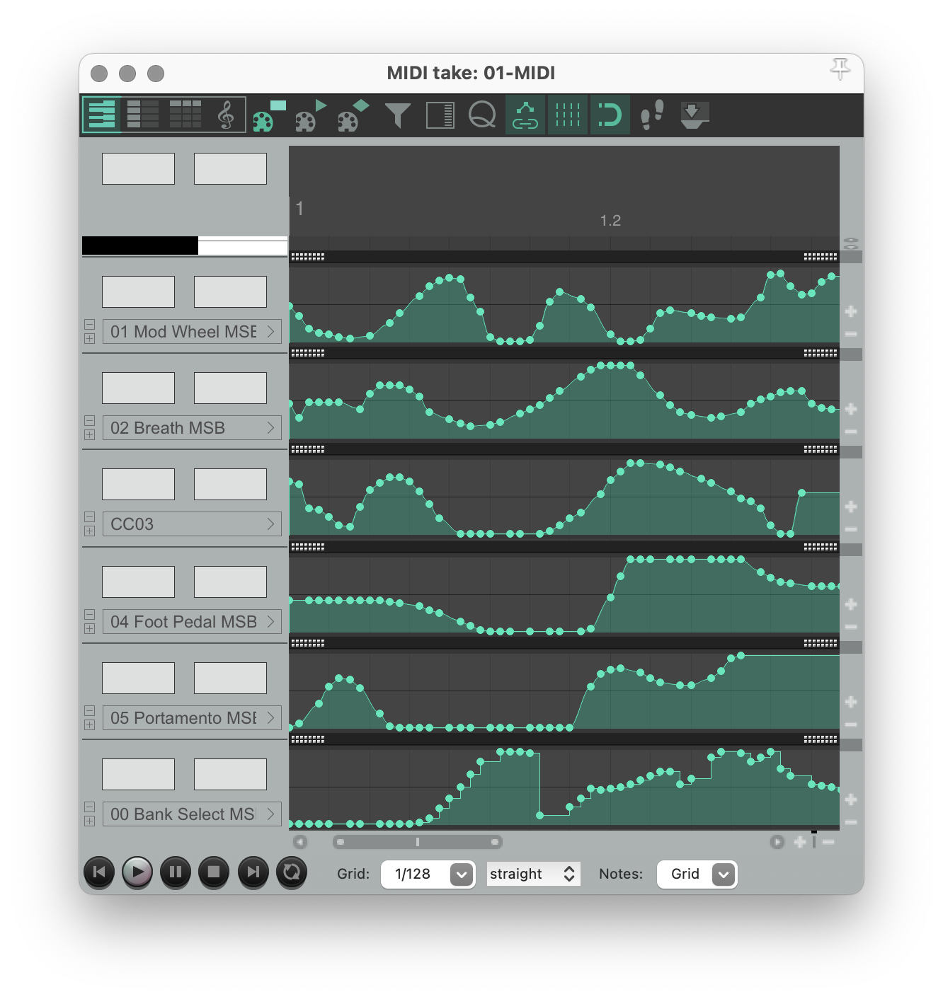

#### Via le bouton *Route*

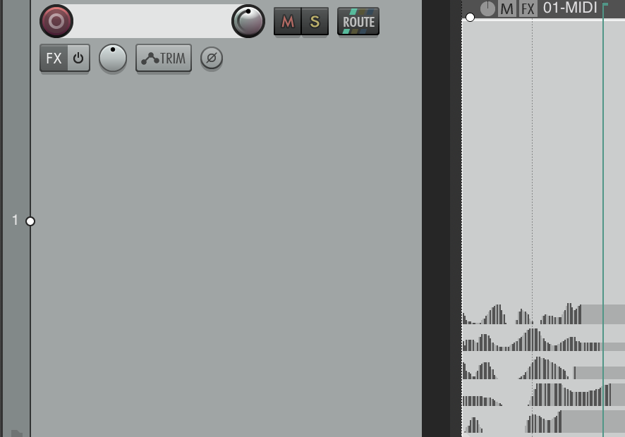

#### Sélectionner un *Midi Hardware output* sortie midi 

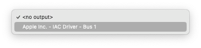