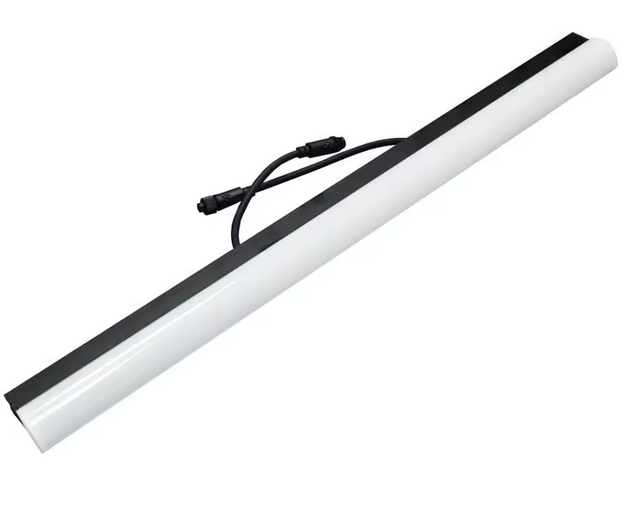
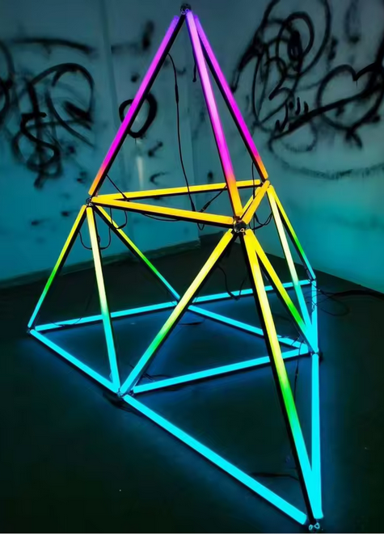

# Barre pixels DEL

## Produit

### Longueur 1m

### Diffusion rond 

### Site

https://www.aliexpress.com/item/1005001807709486.html

### Images

* 
* 

### Spécifications

| Caractéristique | Valeur |
|---|---|
| Nom du produit | LED Pixel Bar |
| Tension d'entrée | DC 24 V |
| Puissance maximale | 15 W / m — 7,5 W / 0,5 m |
| Quantité de LED | 64 LEDs / m |
| Pixels | 64 pixels / 1 m, 32 pixels / 0,5 m |
| Angle de vue | 120° |
| IC | SK6812 |
| Type de LED | 5050 RGB |
| Indice de protection | IP67 |
| Modèle | JAD-5050RGB64-SK6812 |
| Couleurs | RVB complet, effet "dream color" |

