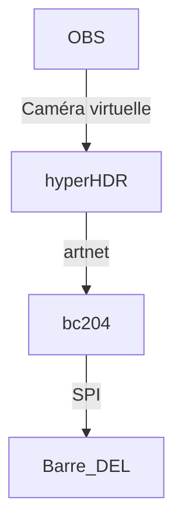

<!-- %: BLOC3_SAVOIR4  -->
# Réalisation d’une composition de lumières scéniques
<!-- %; -->

## Brancher barres de lumière DEL individuellement adressable 

## Matériaux 

* [Barre LED](./LED-stage-pixel-bar/)
* [Controlleur Artnet pour barre LED](./bc-204/)

## Branchement

* Utilisation de vidéo temps réel créer de la lumière  
* OBS -> camera virtuel -> hyperHDR -> artnet -> bc204 (SPI artnet pour LED)

