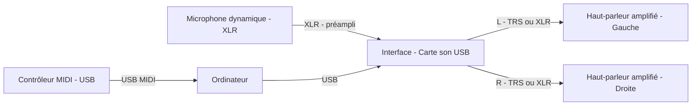
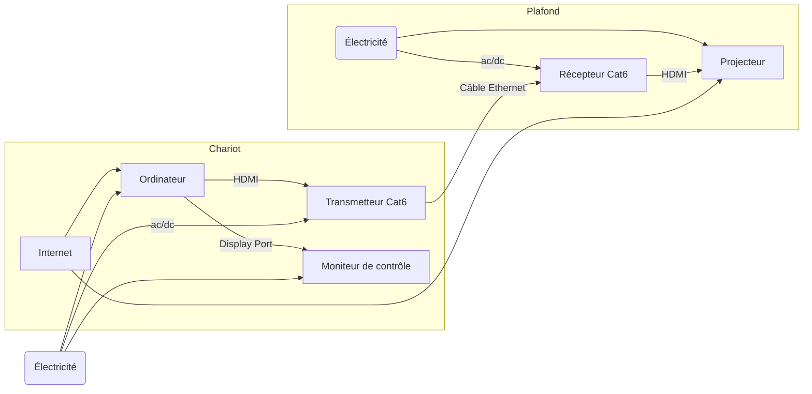

# EVS TP2 : <!-- %: BLOC2 -->Diffusion audio spatialisée<!-- %; -->

 <!-- %: SEANCE_EVS_3 -->
[S7](../../01-deroulement/03/)
<!-- %; -->

##  <!-- %: PONDERATION_EVS_2 -->20%<!-- %; -->

### Description

Réaliser une installation interactive sonore stéréo (MIDI + audio traité en temps réel). L'étudiant·e devra concevoir et présenter un dispositif où le son capté (micro) et/ou les commandes MIDI pilotent en temps réel une projection vidéo. L'accent est mis sur la réactivité, la stabilité et la clarté du mapping audio→visuel.

Consignes principales :
- Utiliser un microphone XLR et une interface audio USB pour l'entrée sonore.
- Utiliser un contrôleur MIDI USB pour envoyer des commandes et/ou modulations.
- Le traitement et l'analyse audio doivent être réalisés en temps réel (FFT, enveloppe, détection d'onsets ou autres).
- La sortie audio est stéréo vers deux enceintes amplifiées ; la sortie vidéo est envoyée au projecteur.

#### Composantes à brancher (schémas)

## Audio

## Video

### Branchement d'un projecteur vidéo en studio

### Brève description

L’installation permet de piloter une projection vidéo interactive synchronisée au son : le contrôleur MIDI et le micro alimentent l’ordinateur (centre de production), l’ordinateur produit l’audio via l’interface vers deux enceintes amplifiées, et envoie la vidéo au projecteur via un émetteur/récepteur HDMI-over-Cat6. L’interactivité est réalisée dans le logiciel sur l’ordinateur qui reçoit MIDI et audio, et déclenche visuels et sons en temps réel.

#### Forme de l'évaluation

* [x] Individuel
* [ ] Équipe

### Savoirs essentiels, principaux critères d'évaluation

 - Conception d'un mapping audio→visuel clair et justifié.
 - Implémentation technique stable et réactive (latence et absence de clipping).
 - Qualité de l'interaction et cohérence artistique.
 - Branchement et installation impécable

---

*Remarque : vérifier les alimentations des émetteurs/récepteurs HDMI-over-Cat6 avant mise en route.*
# EVS TP2 : <!-- %: BLOC2 -->Diffusion audio spatialisée<!-- %; -->

 <!-- %: SEANCE_EVS_3 -->
[S7](../../01-deroulement/03/)
<!-- %; -->

##  <!-- %: PONDERATION_EVS_2 -->20%<!-- %; -->

### Description

<!-- %: DESCRIPTION_EVS_2  -->
Réaliser une installation audiovisuelle
<!-- %; -->

#### Forme de l'évaluation

* [x] Individuel
* [ ] Équipe

### Savoirs essentiels, principaux critères d'évaluation
 